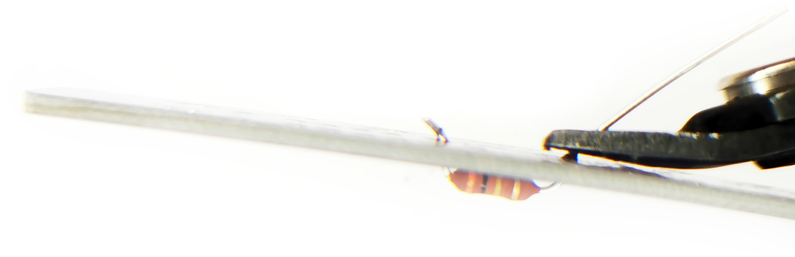
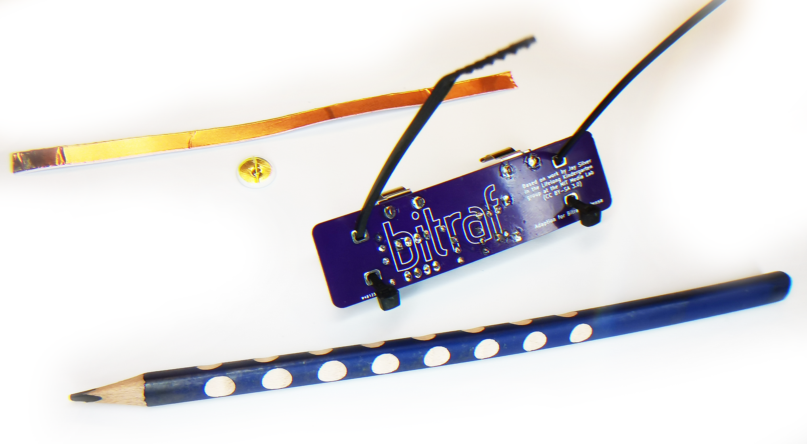

# Instruksjoner
For å bygge settet trenger du en loddebolt, en avbiter-tang og litt loddetinn. Om du ikke har dette kan du stikke innom Bitraf og låne utstyr hos oss.

Komponentene faller lettere ut hvis du lodder de høye komponentene først. Det er derfor lurt å starte med de laveste komponentene. 

Start med de to motstandene (R1 og R2). Bøy bena ca 90 grader så de passer inn i hullene og skyv motstanden helt ned mot kortet så bena stikker langt ut på baksiden. Snu kortet og bøy litt bena ut.

Dette gjør at motstanden holder seg på plass mens du lodder den. Det er lettere å få riktig mengde loddetinn hvis man bruker tynt loddetinn (0.5mm), men du kan bruke det du har tilgjengelig.

Start med å ta bittelitt loddetinn på tuppen av loddebolten - så lite at tuppen blir "våt", men ikke så mye at det danner seg en dråpe. Dette gjør det lett for varmen å krype fra loddebolten og over til det vi skal lodde. Plasser tuppen av loddebolten så den både rører hullet og benet på motstanden vi skal lodde.

Målet er at du skal ta på nok loddetinn til å fylle igjen hullet, men ikke så mye at det ser ut som det ligger en dråpe der. Den perfekte mengden loddetinn ser ut som en liten fjelltopp som trekker seg oppover benet på komponenten. Hvis du ikke har så mye loddet før, anbefaler vi å sjekke ut den [flotte guiden](FullSolderComic_EN.pdf) som [Mighty Ohm](https://mightyohm.com/blog/2011/04/soldering-is-easy-comic-book/) har laget. Det er denne vi bruker på loddekurs på Bitraf.

Når begge bena er loddet, klipper du av bena så langt ned mot kortet som du kan med en tang.

Gjenta prosessen for den andre motstanden. Hvis du sliter med å finne noen av komponentene - let gjerne i nærheten av høyttaleren? Denne er magnetisk, så den har en viss samlende effekt... Vær også litt ekstra forsiktig med den, så ikke høyttaler-membranet blir skadet.

Lodd deretter de to kondensatorene som er små (C3 først og så C2). Når disse er på plass kan du ta frem høyttaleren. Bøy de to bena så de står rett opp når høyttaleren ligger med høyttaler-elementet ned mot bordet, slik som på bildet.

Når høyttaleren er loddet på plass, bør kretskortet ligne på bildet nedenfor.

Den neste delen er holderen som sørger for at chippen ikke blir sittende feil vei. Denne har 8 ben og i den ene enden er det en liten bue. Denne er montert riktig vei når buen i plasten sitter samme vei som buen på kortet. Når du har satt denne på plass, kan du bøye et ben i hvert hjørne, slik at den holder seg på plass når du snur kortet rundt for å lodde.

Etter at alle 8 ben er loddet, kan du finne frem de to transistorene. Disse har 3 ben og det står skrevet noe med bitteliten skrift på den svarte plasten. Legg også merke til at der skriften står er det flatt, mens bakenfor er det buet. Dette skal stemme med bildet av flaten/buen som er trykt på kretskortet. Den første som skal monteres er transistoren som er merket med 2222A.

På den andre transistoren står det 2907a. Denne skal monteres rett foran den andre.

Den lille, runde "tønna" med to ben er også en kondensator, men denne må vi passe på å sette riktig vei. Ned langs siden på denne er det en lys stripe med minus-tegn på og denne skal peke mot høyttaleren.

Bena på kondensatoren blir sittende ganske tett, så om det blir for mye loddetinn kan det danne seg en liten "lodde-bro". For å fjerne denne kan du bruke en loddepumpe (solder pump) eller loddeveke (solder braid) som du ser nedenfor. 

Loddeveken suger til seg overfødig loddetinn når du varmer den opp. Noen ganger går det faktisk enda lettere hvis man tar på bittelitt loddetinn på veken. Dette er på samme måte som at en våt klut fjerner vann lettere enn en tørr klut.

Nå kan vi putte chippen forsiktig inn i holderen sin. Hold gjerne den ene siden med ben ned mot bordet mens du trykker forsiktig ned. På denne måten blir alle bena trykket like mye inn.

På toppen av chippen er det en liten prikk. Denne forteller oss hvor pinne 1 er og denne skal peke vekk fra høyttaleren slik som på bildet. Sjekk at din ligner på bildet

Det neste er batteri-holderen. Dytt pinnene ned i hullene og lodd fra baksiden som for alt det andre. Disse hullene er store, så du trenger mye loddetinn for å fylle dem opp. Om du sliter med å få loddetinnet til å smelte i hullet - ta loddetinn på loddebolten så går det lettere.

Når batteri-holderne er montert kan du teste om elektronikken virker! Putt inn batteriet og ta på endene av elektronikken så skal det komme lyd! Det blir litt lavere lyd når strømmen skal gjennom blyanten, men det er lurt å teste før man går videre. Hvis det ikke kommer lyd, gå tilbake i instruksjonene og sjekk at du har fått med deg alt. Pass spesielt på orienteringen av den runde kondensatoren.

Da er det tid for montere blyanten. Finn frem strips, kobber-tape, tegnestift og blyant. Tre stripsene inn i hullene i kretskortene. Pass på at de er rotert riktig vei.

Lukk stripsene, men ikke før du har puttet inn blyenten. Kretskortet skal sitte helt øverst på blyanten og kretskortet skal roteres så høyttaleren er ved enden av blyanten. Stram stripsene rundt blyanten så godt du klarer. Når du er ferdig, kan du klippe av det som stikker ut på strips'en. 

Riv av en bitteliten bit av kobber-tapen som er lang nok til å gå fra kretskortet og til enden av blyanten. Stikk tegnestiften gjennom tapen så den treffer blyet i midten av blyanten. Det er dette som lager koblingen fra elektronikken og ned på papiret.

Den resterende tapen skal festes nedover blyanten - for eksempel som på bildet nedenfor.

Nå er alt klart til bruk! Start med å tegne en tykk strek (med mange streker frem og tilbake). Tegn med den ene hånden og hold fingeren på den andre hånden et annet sted på streken så kan du høre at du tegner! Vis frem til venner og familie!

Med litt øvelse kan du tegne små instrumenter som kan spilles på! Husk å ta batteriet ut av blyanten når du ikke bruker den, ellers vil batteriet lades ut ganske raskt.